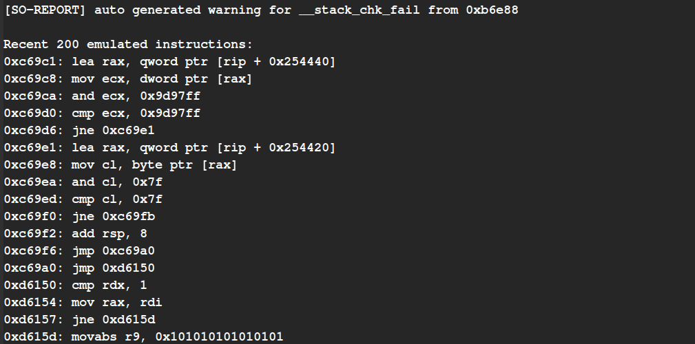
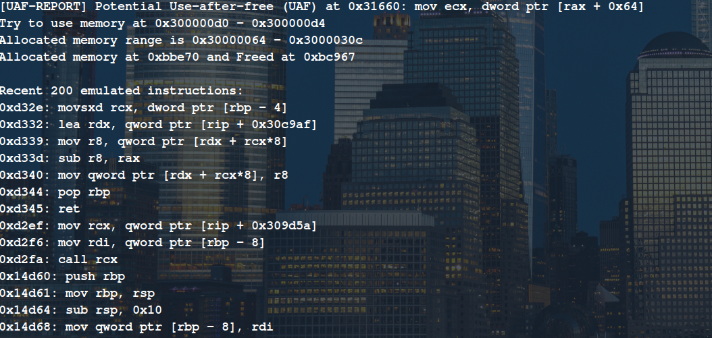

# COIN ATTACK [ASPLOS 2020]


COIN attack demonstrates the weakness in SGX enclave software model. We define three attacks in the enclave interface:
* ECALL permutation
* Concurrent ECALLs
* Input manipulation

We have developed an extensible framework to independently analyze an enclave on the presence of COIN attack. Our prototype have implemented 8 security policies that could detect:
* Heap memory leak
* Stack memory leak
* Ineffectual condition
* Use-after-free
* Double free
* Stack overflow
* Heap overflow
* Null pointer dereference

**The paper will be appeared in the ASPLOS 2020 conference. This repository is for the framework source code.**

## Prototype
The prototype is built for following system:
* Intel x86-64 machine (64GB memory)
* Linux Distribution (preferably 4.15.0)
* Intel SGX SDK

*Note: It is not required to use a real Intel SGX machine.*

## Source
```
COIN Attack
|
|--src
      |
      |--semantics
                  |
                  |--llvm_src
                             |
                             |--llvm/lib/Transforms/EnclaveSemantics/EnclaveSemantics.cpp
                  |
                  |--pyedl
                          |
                          |--edlParse.py
      |
      |--core
             |
             |--Triton/src/enclaveCoverage/coverage.py
             |
             |--Triton/src/enclaveCoverage/policies.py
|
|--scripts
          |
          |--PoCs
          |
          |--SGX_SQLite
|
|--PoCs
       |
       |--App
             |
             |--App.cpp
       |
       |--Enclave
                 |
                 |--Enclave.edl
                 |
                 |--Enclave.cpp
       |
       |--Makefile
```

## Build
### LLVM Tool
1. Install required library for Gold plugin:
```text
sudo apt-get install linux-headers-$(uname -r) csh gawk automake libtool bison flex libncurses5-dev
# Check 'makeinfo -v'. If 'makeinfo' does not exist
sudo apt-get install apt-file texinfo texi2html
sudo apt-file update
sudo apt-file search makeinfo
```

2. Download binutils source code:
```text
cd ~
git clone --depth 1 git://sourceware.org/git/binutils-gdb.git binutils
```

3. Build binutils:
```text
mkdir build
cd build
../binutils/configure --enable-gold --enable-plugins --disable-werror
make
```

4. Build the compiler (use the binutils directory if you already have one):
```text
cd $PROJECT_ROOT/src/semantics/llvm_src/
mkdir build
cmake -DLLVM_BINUTILS_INCDIR="path_to_binutils/include" -G "Unix Makefiles" ../llvm
make -j8
```

5. Backup ar, nm, ld and ranlib:
```text
cd ~
mkdir backup
cd /usr/bin/
cp ar ~/backup/
cp nm ~/backup/
cp ld ~/backup/
cp ranlib ~/backup/
```

6. Replace ar, nm, ld and ranlib:
```text
cd /usr/bin/
sudo cp ~/build/binutils/ar ./
sudo rm nm
sudo cp ~/build/binutils/nm-new ./nm
sudo cp ~/build/binutils/ranlib ./
sudo cp ~/build/gold/ld-new ./ld
```

7. Install LLVMgold.so to /usr/lib/bfd-plugins:
```text
cd /usr/lib
sudo mkdir bfd-plugins
cd bfd-plugins
sudo cp $PROJECT_ROOT/src/semantics/llvm_src/build/lib/LLVMgold.so ./
sudo cp $PROJECT_ROOT/src/semantics/llvm_src/build/lib/libLTO.* ./
```

### Triton
1. Python LIEF library install.
```
sudo pip install lief
```
2. Build z3 solver from the source:
```
cd $PROJECT_ROOT/src/core/
git clone https://github.com/Z3Prover/z3.git
cd z3
python scripts/mk_make.py
cd build
make
sudo make install
```
3. Build the Triton symbolic engine.
```text
cd $PROJECT_ROOT/src/core/Triton
mkdir build
cd build
cmake ..
sudo make -j2 install
```
### SGX SDK
Install the Intel SGX SDK following the guideline: https://github.com/intel/linux-sgx

## Run
There are scripts available to run PoCs and GitHub projects into the system. For example, to test SGX_SQLite projects, use:
```
cd $PROJECT_ROOT/scripts/SGX_SQLite/
./run.sh
```

## Screenshots




*Note: Some part of this project was developed while I was intern at Baidu X-lab.*